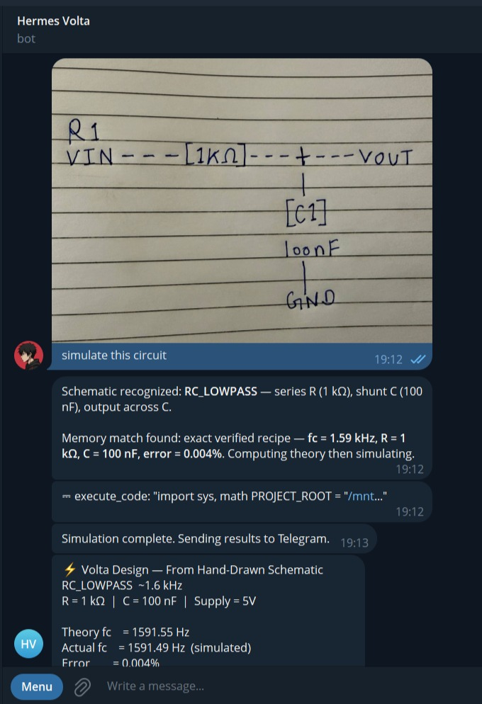
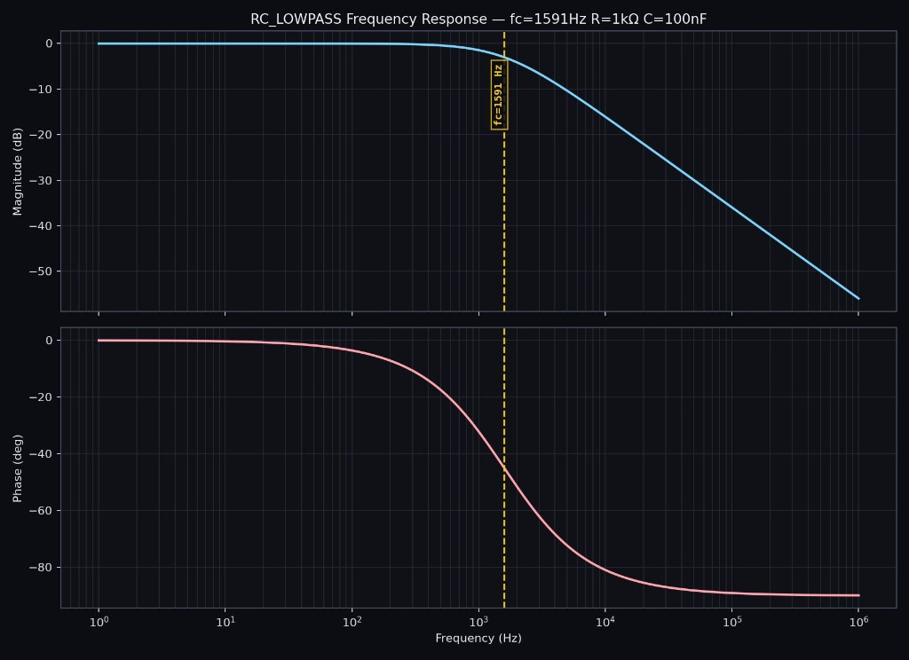
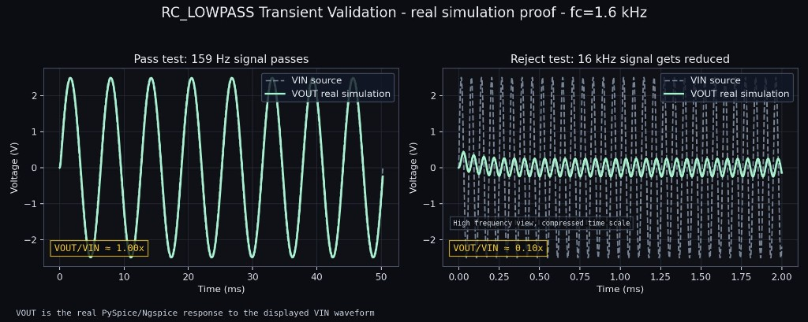
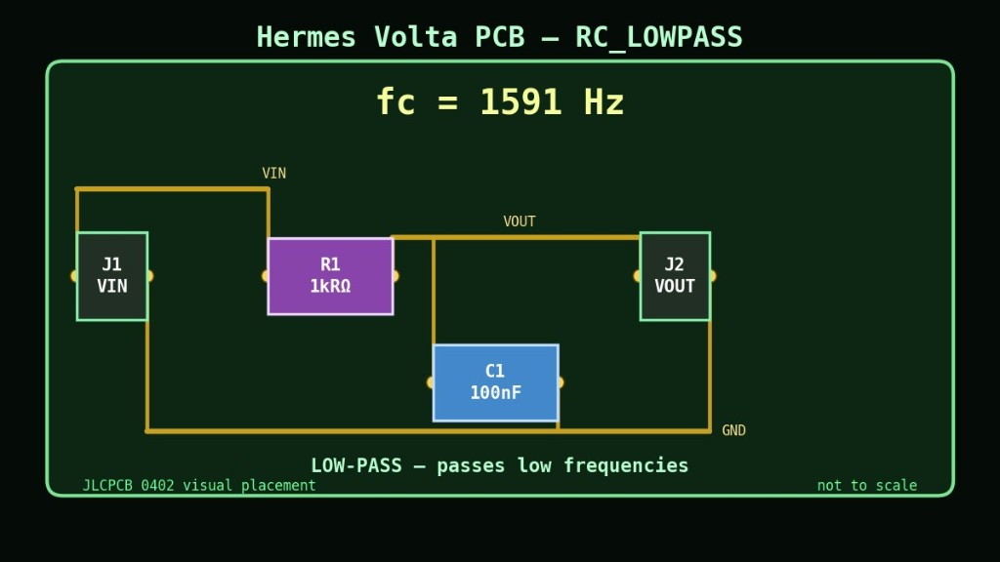
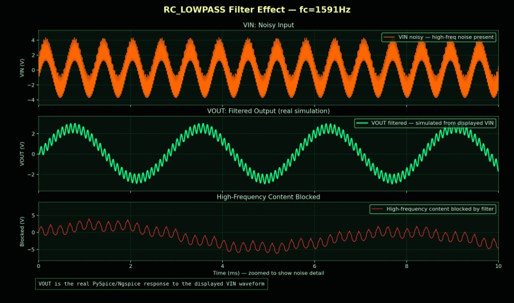
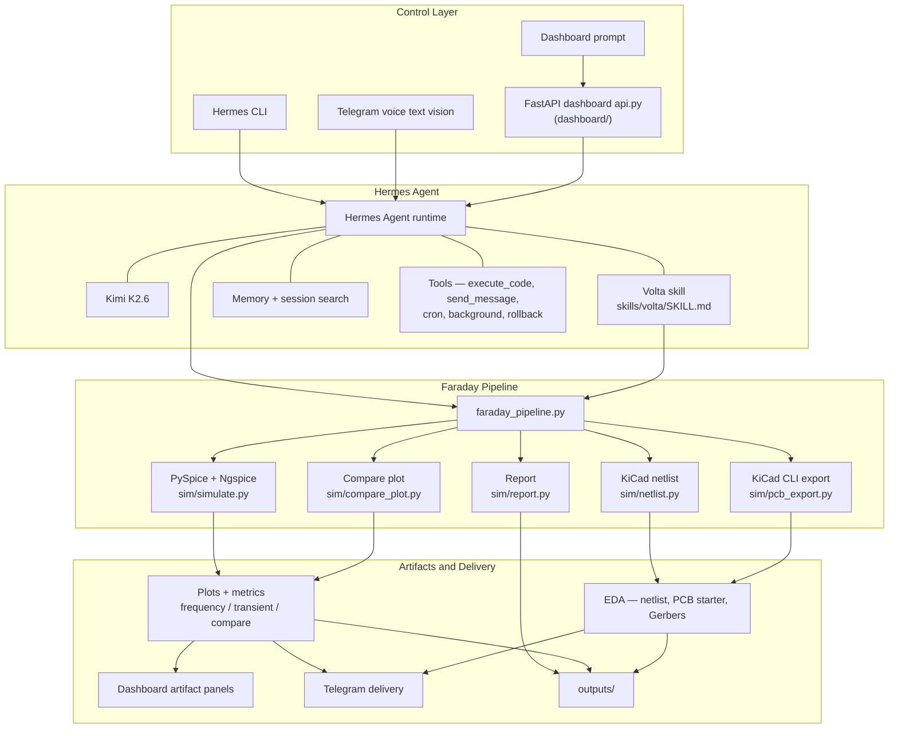

# Hermes Volta

[](https://www.python.org)
[](https://github.com/NousResearch/hermes-agent)
[](https://kimi.moonshot.cn)
[](https://opensource.org/licenses/MIT)

Hermes Volta is an autonomous circuit design agent built natively on Hermes Agent by Nous Research. Powered by Kimi K2.6.

Say a circuit in plain English — by voice, text, or photo of a hand-drawn schematic — and Hermes Volta computes the components, runs a real PySpice/Ngspice simulation, generates KiCad artifacts and Gerbers, and delivers everything to your Telegram. The agent learns from every design, patches its own skill file, and gets measurably faster over time.

Built for The Hermes Agent Creative Hackathon by Nous Research.

## Demo Video

[](https://youtu.be/Qx1U6dPjKfs)

## Screenshots

### Vision — Hand-Drawn Schematic to Simulation

User sends a photo of a hand-drawn RC circuit on paper to Telegram.
Volta recognizes the topology and values using vision analysis:
"Schematic recognized: RC_LOWPASS — series R (1 kΩ), shunt C (100 nF)"
Memory match found: fc = 1.59 kHz, error = 0.004% — essentially perfect.
Delivers full simulation artifacts back to Telegram automatically.



### Bode Plot — fc=1591Hz, R=1kΩ, C=100nF

Theory fc = 1591.55 Hz | Actual fc = 1591.49 Hz | Error = 0.004%



### Transient Validation — Real Simulation Proof

159Hz signal passes (VOUT/VIN = 1.00x) | 16kHz signal rejected (VOUT/VIN = 0.10x)



### PCB Layout — JLCPCB Ready

fc = 1591Hz | R1 = 1kΩ | C1 = 100nF | 0402 SMD



### Filter Effect — VIN vs VOUT vs Noise Blocked

Top: noisy input | Middle: filtered output (real PySpice simulation) |
Bottom: high-frequency noise blocked by filter



## Architecture

This repository packages the Volta skill, simulation and EDA pipeline (`sim/`), dashboard API (`dashboard/`), tests, and tooling. Hermes Agent is the orchestrator at runtime.



**Accuracy note:** [`sim/sweep_optimizer.py`](sim/sweep_optimizer.py) and [`sim/monte_carlo.py`](sim/monte_carlo.py) are separate CLIs the agent invokes through Hermes tooling; they are **not** called inside `faraday_pipeline.run()`. **`sim/compare_plot.py` is invoked at the end of `run()`** (after reports) so `compare_plot.png` lands with each design bundle.

The diagram summarizes how control surfaces, Hermes/Kimi, and the Volta pipeline connect to inspectable outputs. For the feature-level breakdown, see [**Skills And Tools**](#skills-and-tools) below.

More detail: [docs/ARCHITECTURE.md](docs/ARCHITECTURE.md)

Public demo docs:

- [Hackathon plan](docs/HACKATHON.md)
- [Demo script](docs/DEMO_SCRIPT.md)
- [Demo artifact gallery](docs/DEMO_ARTIFACTS.md)
- [Volta persona](docs/VOLTA_PERSONA.md)
- [Agent context](docs/AGENT_CONTEXT.md)

### Where Hermes Agent Is

`hermes-agent/` is a **[git submodule](https://git-scm.com/book/en/v2/Git-Tools-Submodules)** that pins **[Nous Research Hermes Agent](https://github.com/NousResearch/hermes-agent)** next to Volta sources. Hermes-local virtual environments under `hermes-agent/.venv/` stay untracked (see root `.gitignore`).

Bring it in after **clone**:

```bash
git clone --recurse-submodules <repo-url>
```

Or on an existing clone:

```bash
git submodule update --init --recursive
```

The repo integrates with Hermes Agent through:

- `skills/volta/SKILL.md` and `skills/volta/references/`
- Hermes tool calls such as `execute_code`, `send_message`, cron, background sessions, rollback, memory, and session search
- `sim/faraday_pipeline.py`, the main executable design pipeline
- `dashboard/api.py`, which exposes the Volta pipeline through the dashboard/API

## Skills And Tools

### Volta Custom Skill — skills/volta/SKILL.md

The Volta skill is a custom Hermes skill that teaches the agent to design circuits. It defines:

- Circuit topology selection (RC_LOWPASS, RC_HIGHPASS, RLC_BANDPASS, RLC_NOTCH)
- E24 component value computation using verified filter math
- PySpice/Ngspice simulation and cutoff validation
- KiCad netlist, PCB, Gerber generation
- 8-message Telegram delivery bundle
- Learning loop — patches itself with verified recipes

Reference files in `skills/volta/references/`:

| File | Purpose |
| --- | --- |
| filter_math.md | RC and RLC filter equations |
| component_recipes.md | Verified E24 component pairs |
| kicad_footprints.md | JLCPCB 0402 footprint rules |
| extended_docs.md | Extended design guidance |

### Volta Custom Tools — tools/

| Tool | Purpose |
| --- | --- |
| rl_trajectory.py | Records design trajectories for RL training |
| submit_trajectory.py | Bundles and submits trajectories |
| check_bom_prices.py | Checks live JLCPCB/LCSC component prices |
| component_search.py | Searches components by value and footprint |
| webhook.py | Webhook handler for external integrations |

Hermes Volta is designed as a Hermes Agent capability showcase. The circuit pipeline is only one layer; the demo also exercises Hermes skills, memory, messaging, multimodal input, scheduling, background execution, and tool-driven engineering work.

### Hermes Skills

| Skill / capability | What it does in Volta |
| --- | --- |
| Skill growth | The agent updates skill/reference guidance when a design reveals a durable workflow improvement. |
| Memory | Verified recipes are saved so future requests can reuse known-good component values and simulation results. |
| Session search | Prior designs can be recalled and scaled, for example taking the most accurate design and retargeting it to 8 kHz. |
| Context references | Prompts such as `@MEMORY.md which design should I use for a guitar pedal?` use project context directly. |

### Hermes Tools

| Tool / surface | What it does in Volta |
| --- | --- |
| `execute_code` / terminal | Runs PySpice, Ngspice, KiCad CLI, E24 sweeps, Monte Carlo checks, and report generation. |
| `send_message` | Delivers summaries, plots, reports, Gerbers, and engineering notes to Telegram. |
| Voice mode | Telegram voice prompts can trigger circuit generation. |
| Vision analysis | Hand-drawn schematic photos can be interpreted and mapped to supported circuit types. |
| Web search / Firecrawl | Autonomous mode researches project domains such as ECG, drone vibration, or guitar pedal filtering. |
| Cron jobs | BOM checks can be scheduled, such as weekly JLCPCB/LCSC review. |
| Background sessions | Longer designs can run without blocking the chat. |
| Rollback / history | Previous designs can be restored for comparison or recovery. |
| RL trajectory logging | `tools/rl_trajectory.py` records learned design trajectories under `outputs/trajectories/`. |
| Dashboard/API | FastAPI dashboard streams pipeline progress and serves an OpenAI-compatible `/v1` endpoint. |

## Why It Matters

Most AI circuit demos stop at explanation. Hermes Volta produces artifacts an engineer can inspect:

- Theory values and practical E24 component choices
- Real AC and transient simulation through PySpice/Ngspice
- Bode response, transient validation, and VIN vs VOUT effect plots
- KiCad legacy netlist, starter `.kicad_pcb`, Gerber zip, and PCB preview
- Text report with cutoff error, BOM strings, and output paths
- Telegram delivery and an OpenAI-compatible dashboard API

## Hackathon Demo Flow

The submitted demo video shows CLI, Telegram, and dashboard surfaces:

- CLI: skills, learning loop, batch design, delegation, memory/session search, autonomous web search, context references, RL trajectories, and skill-file growth.
- Telegram: voice, vision, autonomous mode, cron scheduling, background design, PCB render, and rollback.
- Dashboard: live run design, four artifact panels, design history navigation, and streamed Hermes progress.

1. Open the live dashboard at `http://localhost:8765`.
2. Enter a prompt such as:

   ```text
   design a 7kHz low-pass filter at 3.3V
   ```

3. Watch the Hermes Stream panel show pipeline progress:

   ```text
   [Volta] Starting RC_LOWPASS...
   [Volta] Running PySpice/Ngspice simulation...
   [Volta] Simulation actual_fc=7234.21 Hz, error=3.346%
   [Volta] Generating KiCad netlist...
   [Volta] Exporting PCB artifacts with kicad-cli...
   [Volta] Writing cutoff report...
   [Volta] Done.
   ```

4. The dashboard refreshes with:

   - Bode plot
   - PCB visual
   - Full-width transient validation plot
   - Filter effect plot showing VIN, VOUT, and rejected/difference content
   - Cutoff report

5. If Hermes Telegram is configured, Volta also sends the summary and artifacts to Telegram.

## Current EDA Truth

Hermes Volta currently generates **KiCad-compatible starter artifacts**, not a production-routed PCB.

Generated EDA artifacts include:

- `circuit.net`: KiCad legacy XML netlist with components, footprints, and nets
- `circuit.kicad_pcb`: minimal starter board file with board outline
- `gerbers.zip`: Gerbers exported by `kicad-cli`
- `pcb_view.png`: Matplotlib PCB preview generated from the netlist

Generated boards are starting points for engineering review, not production-approved layouts.

## Supported Circuits

| Circuit type | Purpose | Formula |
| --- | --- | --- |
| `RC_LOWPASS` | Pass low frequencies, attenuate high-frequency noise | `fc = 1 / (2*pi*R*C)` |
| `RC_HIGHPASS` | Block DC/slow drift, pass higher-frequency signals | `fc = 1 / (2*pi*R*C)` |
| `RLC_BANDPASS` | Pass a resonant center frequency | `f0 = 1 / (2*pi*sqrt(L*C))` |
| `RLC_NOTCH` | Reject a resonant center frequency | `f0 = 1 / (2*pi*sqrt(L*C))` |

## Repository Layout

```text
docs/             Architecture, hackathon, and demo notes
docs/demo_artifacts/
                  Curated demo images for GitHub browsing
dashboard/       FastAPI dashboard and live artifact UI
hermes-agent/    Hermes Agent (git submodule → NousResearch/hermes-agent)
sim/             Simulation, netlist, PCB export, report, compare plots
skills/volta/    Hermes Agent skill and references
tests/           Smoke test suite
tools/           Trajectory, webhook, BOM helper tools
outputs/         Generated artifacts, ignored by git
requirements.txt Pinned pip dependencies (dashboard + simulation stack)
```

## Quick Start

Designed for Linux, macOS, or **WSL2** with Ngspice and optionally KiCad CLI. Python packages are pinned in [`requirements.txt`](requirements.txt). [`skills/volta/scripts/install_deps.sh`](skills/volta/scripts/install_deps.sh) installs system deps where it can (apt/brew), creates `./.venv`, and pip-installs Volta stacks. Override `VOLTA_PROJECT_ROOT` only if paths are unconventional; use `VOLTA_PYTHON` only if plain `python3` is not the interpreter you populated.

```bash
git clone --recurse-submodules https://github.com/Snehal707/Hermes-volta.git hermes-volta
cd hermes-volta
# If you cloned without --recurse-submodules: git submodule update --init --recursive
bash skills/volta/scripts/install_deps.sh
python3 dashboard/api.py
```

If `python3` does not see packages after `install_deps.sh`, run the dashboard with the interpreter that script populated (for example `.venv/bin/python3`).

Open:

```text
http://localhost:8765
```

For a fresh install on another machine:

```bash
git clone --recurse-submodules https://github.com/Snehal707/Hermes-volta.git hermes-volta
cd hermes-volta
git submodule update --init --recursive
bash skills/volta/scripts/install_deps.sh
```

## Run The Pipeline Directly

Use PySpice-capable `python3` (override with `$VOLTA_PYTHON` if needed):

```bash
PY="${VOLTA_PYTHON:-python3}"
"$PY" - <<'PY'
from sim.faraday_pipeline import run

result = run(
    circuit_type="RC_LOWPASS",
    R=1600,
    C=1e-7,
    supply_v=5.0,
    L=None,
    fc=1000,
    description="1kHz audio low-pass filter",
)
print(result)
PY
```

## Useful Commands

Set once: `PY="${VOLTA_PYTHON:-python3}"`.

E24 resistor sweep:

```bash
$PY sim/sweep_optimizer.py --fc 1000 --C 1e-7
```

Monte Carlo tolerance check:

```bash
$PY sim/monte_carlo.py --R 1600 --C 1e-7 --fc 1000 --n 1000
```

Full smoke test:

```bash
$PY tests/smoke_test.py
```

## Dashboard API

Volta exposes both a browser dashboard and an OpenAI-compatible API:

```text
Dashboard: http://localhost:8765
OpenAI-compatible base URL: http://localhost:8765/v1
Model: volta-1.0
```

The `/design` endpoint streams deterministic Volta pipeline progress directly to the dashboard.

## Kimi Track Note

Hermes Volta is model-agnostic through Hermes Agent. The hackathon demo was run with **Kimi K2.6**, while the circuit pipeline itself remains deterministic and auditable.

## Tech Stack

| Layer | Technology |
|---|---|
| Agent Runtime | Hermes Agent by Nous Research |
| LLM | Kimi K2.6 by Moonshot AI |
| Circuit Simulation | PySpice + Ngspice |
| EDA / PCB | KiCad + kicad-cli + SKiDL |
| Dashboard | FastAPI + Matplotlib |
| Delivery | Telegram Bot API |
| Web Search | Firecrawl |
| Language | Python 3.11+ |

## Validation Status

Recent local smoke tests passed `13/13`, covering simulation, batch runs, optimizer, Monte Carlo, compare plot, netlist generation, PCB export, report generation, Telegram delivery, math accuracy, and Firecrawl availability.

## Credits

- **[Hermes Agent](https://github.com/NousResearch/hermes-agent)** — orchestration runtime from **[Nous Research](https://github.com/NousResearch)** (`execute_code`, memory, Telegram, cron, dashboards). Hermes Volta plugs into these surfaces.
- **[Kimi K2.6](https://kimi.moonshot.cn)** — [Moonshot AI](https://www.moonshot.cn/) foundation model cited for the Hermes Agent Creative Hackathon demo; Volta remains model-agnostic and the deterministic `sim/` pipeline is independent of LLM choice.
- **Circuit simulation & EDA** — [PySpice](https://github.com/PySpiceOrg/PySpice), [Ngspice](https://ngspice.sourceforge.net/), [KiCad](https://www.kicad.org/) (including [`kicad-cli`](https://docs.kicad.org/master/en/cli/cli.html)), and [SKiDL](https://github.com/devbisme/skidl) for netlisting (with KiCad fallback where needed).
- **Dashboard** — [FastAPI](https://fastapi.tiangolo.com/), [Matplotlib](https://matplotlib.org/) (Agg plots under `outputs/`), plus the broader Python Scientific stack in [`requirements.txt`](requirements.txt).

## Author

Built by Snehal.

- GitHub: `Snehal707`
- X: `@SnehalRekt`
- Telegram: `@Snehal_7`

## License

MIT


