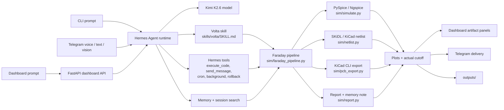

# Hermes Volta

Natural-language analog circuit design for Hermes Agent.

Hermes Volta turns a plain-English filter request into computed component values, real PySpice/Ngspice simulation, validation plots, KiCad-compatible EDA artifacts, Gerbers, reports, Telegram delivery, and a live cyber-green dashboard.

**Built for The Hermes Agent Creative Hackathon by Nous Research.** This repository is a hackathon submission showing Hermes Agent pushed into an engineering/creative software domain: analog circuit design from natural language, multimodal Telegram control, live dashboard streaming, memory, skills, web search, scheduling, and generated EDA artifacts.

## Demo Video

[](https://youtu.be/Qx1U6dPjKfs)

Watch the hackathon demo: https://youtu.be/Qx1U6dPjKfs

## Interactive Demo Dashboard

https://Snehal707.github.io/hermes-volta/demo-dashboard/

Judges can open the hosted GitHub Pages dashboard to browse saved design history without running the backend.

> Demo prompt: `design a 2kHz high-pass filter for a microphone at 5V`

## Architecture

Hermes Volta runs on top of Hermes Agent. Hermes Agent is the runtime/orchestrator; this repository contains the Volta skill, simulation pipeline, dashboard, tests, and helper tools.



More detail: [docs/ARCHITECTURE.md](docs/ARCHITECTURE.md)

Public demo docs:

- [Hackathon plan](docs/HACKATHON.md)
- [Demo script](docs/DEMO_SCRIPT.md)
- [Demo artifact gallery](docs/DEMO_ARTIFACTS.md)
- [Static demo dashboard](docs/demo-dashboard/index.html)
- [Volta persona](docs/VOLTA_PERSONA.md)
- [Agent context](docs/AGENT_CONTEXT.md)

### Where Hermes Agent Is

`hermes-agent/` is the local Hermes Agent runtime checkout used during development and demos. It is intentionally ignored by git because it is a large external runtime/dependency, not Volta source code. The repo integrates with Hermes Agent through:

- `skills/volta/SKILL.md` and `skills/volta/references/`
- Hermes tool calls such as `execute_code`, `send_message`, cron, background sessions, rollback, memory, and session search
- `sim/faraday_pipeline.py`, the main executable design pipeline
- `dashboard/api.py`, which exposes the Volta pipeline through the dashboard/API

## Hermes Agent Skills And Tools

Hermes Volta is designed as a Hermes Agent capability showcase. The circuit pipeline is only one layer; the demo also exercises Hermes skills, memory, messaging, multimodal input, scheduling, background execution, and tool-driven engineering work.

### Hermes Skills

| Skill / capability | What it does in Volta |
| --- | --- |
| Volta skill | `skills/volta/SKILL.md` defines the analog design workflow, safety rules, Telegram delivery gate, and learning behavior. |
| Skill references | `filter_math.md`, `kicad_footprints.md`, `component_recipes.md`, and `extended_docs.md` give reusable circuit math, EDA guidance, and process rules. |
| Skill growth | The agent updates skill/reference guidance when a design reveals a durable workflow improvement. |
| Memory | Verified recipes are saved so future requests can reuse known-good component values and simulation results. |
| Session search | Prior designs can be recalled and scaled, for example taking the most accurate design and retargeting it to 8 kHz. |
| Context references | Prompts such as `@MEMORY.md which design should I use for a guitar pedal?` use project context directly. |

### Hermes Tools

| Tool / surface | What it does in Volta |
| --- | --- |
| `execute_code` / terminal | Runs PySpice, Ngspice, KiCad CLI, E24 sweeps, Monte Carlo checks, and report generation. |
| `send_message` | Delivers summaries, plots, reports, Gerbers, and engineering notes to Telegram. |
| Voice mode | Telegram voice prompts can trigger circuit generation. |
| Vision analysis | Hand-drawn schematic photos can be interpreted and mapped to supported circuit types. |
| Web search / Firecrawl | Autonomous mode researches project domains such as ECG, drone vibration, or guitar pedal filtering. |
| Cron jobs | BOM checks can be scheduled, such as weekly JLCPCB/LCSC review. |
| Background sessions | Longer designs can run without blocking the chat. |
| Rollback / history | Previous designs can be restored for comparison or recovery. |
| RL trajectory logging | `tools/rl_trajectory.py` records learned design trajectories under `outputs/trajectories/`. |
| Dashboard/API | FastAPI dashboard streams pipeline progress and serves an OpenAI-compatible `/v1` endpoint. |

## Why It Matters

Most AI circuit demos stop at explanation. Hermes Volta produces artifacts an engineer can inspect:

- Theory values and practical E24 component choices
- Real AC and transient simulation through PySpice/Ngspice
- Bode response, transient validation, and VIN vs VOUT effect plots
- KiCad legacy netlist, starter `.kicad_pcb`, Gerber zip, and PCB preview
- Text report with cutoff error, BOM strings, and output paths
- Telegram delivery and an OpenAI-compatible dashboard API

## Hackathon Demo Flow

The submitted demo video shows CLI, Telegram, and dashboard surfaces:

- CLI: skills, learning loop, batch design, delegation, memory/session search, autonomous web search, context references, RL trajectories, and skill-file growth.
- Telegram: voice, vision, autonomous mode, cron scheduling, background design, PCB render, and rollback.
- Dashboard: live run design, four artifact panels, design history navigation, and streamed Hermes progress.

1. Open the live dashboard at `http://localhost:8765`.
2. Enter a prompt such as:

   ```text
   design a 7kHz low-pass filter at 3.3V
   ```

3. Watch the Hermes Stream panel show pipeline progress:

   ```text
   [Volta] Starting RC_LOWPASS...
   [Volta] Running PySpice/Ngspice simulation...
   [Volta] Simulation actual_fc=7234.21 Hz, error=3.346%
   [Volta] Generating KiCad netlist...
   [Volta] Exporting PCB artifacts with kicad-cli...
   [Volta] Writing cutoff report...
   [Volta] Done.
   ```

4. The dashboard refreshes with:

   - Bode plot
   - PCB visual
   - Full-width transient validation plot
   - Filter effect plot showing VIN, VOUT, and rejected/difference content
   - Cutoff report

5. If Hermes Telegram is configured, Volta also sends the summary and artifacts to Telegram.

## Current EDA Truth

Hermes Volta currently generates **KiCad-compatible starter artifacts**, not a production-routed PCB.

Generated EDA artifacts include:

- `circuit.net`: KiCad legacy XML netlist with components, footprints, and nets
- `circuit.kicad_pcb`: minimal starter board file with board outline
- `gerbers.zip`: Gerbers exported by `kicad-cli`
- `pcb_view.png`: Matplotlib PCB preview generated from the netlist

Generated boards are starting points for engineering review, not production-approved layouts.

## Supported Circuits

| Circuit type | Purpose | Formula |
| --- | --- | --- |
| `RC_LOWPASS` | Pass low frequencies, attenuate high-frequency noise | `fc = 1 / (2*pi*R*C)` |
| `RC_HIGHPASS` | Block DC/slow drift, pass higher-frequency signals | `fc = 1 / (2*pi*R*C)` |
| `RLC_BANDPASS` | Pass a resonant center frequency | `f0 = 1 / (2*pi*sqrt(L*C))` |
| `RLC_NOTCH` | Reject a resonant center frequency | `f0 = 1 / (2*pi*sqrt(L*C))` |

## Repository Layout

```text
docs/             Architecture, hackathon, and demo notes
docs/demo_artifacts/
                 Curated demo images for GitHub browsing
docs/demo-dashboard/
                 Static backend-free dashboard snapshot
dashboard/        FastAPI dashboard and live artifact UI
sim/              Simulation, netlist, PCB export, report, compare plots
skills/volta/     Hermes Agent skill and references
tests/            Smoke test suite
tools/            Trajectory, webhook, BOM helper tools
outputs/          Generated artifacts, ignored by git
```

## Quick Start

This project was developed under WSL2. For the checked-in project path, use the package-complete venv:

```bash
cd hermes-volta
./hermes-agent/.venv/bin/python3 dashboard/api.py
```

Open:

```text
http://localhost:8765
```

Static dashboard snapshot for judges:

```text
docs/demo-dashboard/index.html
```

Open that file directly in a browser to inspect saved design history without running the backend.

For a fresh install on another machine:

```bash
cd hermes-volta
bash skills/volta/scripts/install_deps.sh
```

## Run The Pipeline Directly

Use the Hermes Volta venv for simulation scripts:

```bash
./hermes-agent/.venv/bin/python3 - <<'PY'
from sim.faraday_pipeline import run

result = run(
    circuit_type="RC_LOWPASS",
    R=1600,
    C=1e-7,
    supply_v=5.0,
    L=None,
    fc=1000,
    description="1kHz audio low-pass filter",
)
print(result)
PY
```

## Useful Commands

E24 resistor sweep:

```bash
./hermes-agent/.venv/bin/python3 sim/sweep_optimizer.py --fc 1000 --C 1e-7
```

Monte Carlo tolerance check:

```bash
./hermes-agent/.venv/bin/python3 sim/monte_carlo.py --R 1600 --C 1e-7 --fc 1000 --n 1000
```

Full smoke test:

```bash
./hermes-agent/.venv/bin/python3 tests/smoke_test.py
```

## Dashboard API

Volta exposes both a browser dashboard and an OpenAI-compatible API:

```text
Dashboard: http://localhost:8765
OpenAI-compatible base URL: http://localhost:8765/v1
Model: volta-1.0
```

The `/design` endpoint streams deterministic Volta pipeline progress directly to the dashboard.

## Kimi Track Note

Hermes Volta is model-agnostic through Hermes Agent. The hackathon demo was run with **Kimi K2.6**, while the circuit pipeline itself remains deterministic and auditable.

## Validation Status

Recent local smoke tests passed `13/13`, covering simulation, batch runs, optimizer, Monte Carlo, compare plot, netlist generation, PCB export, report generation, Telegram delivery, math accuracy, and Firecrawl availability.

## Author

Built by Snehal.

- GitHub: `Snehal707`
- X: `@SnehalRekt`
- Telegram: `@Snehal_7`

## License

MIT
