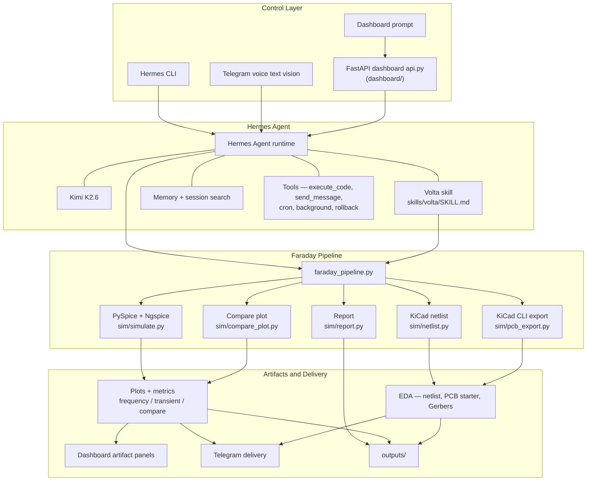

# Hermes Volta Architecture

Hermes Volta is not a standalone chatbot. It is a Hermes Agent project that uses a Volta skill, Python simulation tools, KiCad-compatible export helpers, Telegram delivery, and a browser dashboard to turn natural-language circuit requests into inspectable engineering artifacts.

## System Diagram

This matches the layered architecture shown in [`README.md`](../README.md#architecture).



`sim/sweep_optimizer.py` and `sim/monte_carlo.py` are separate CLI tools Hermes invokes through delegation / terminal—they are **not** called inside `faraday_pipeline.run()`. **`sim/compare_plot.generate_compare_plot` runs at the end of `run()`** (after the report writer) inside [`sim/faraday_pipeline.py`](../sim/faraday_pipeline.py); [`sim/compare_plot.py`](../sim/compare_plot.py) can also be used as its own CLI.

## Where Hermes Agent Lives

The local development machine has a `hermes-agent/` directory at the repo root:

```text
/path/to/hermes-volta/hermes-agent/
```

Set ``VOLTA_PROJECT_ROOT`` when your clone differs. That directory is intentionally not committed. It is ignored by `.gitignore` because it is the external Hermes Agent runtime checkout and virtual environment, not source code owned by Hermes Volta.

The public repo shows the Hermes Agent integration points instead:

| Repo path | Role |
| --- | --- |
| `skills/volta/SKILL.md` | The Hermes skill that teaches the agent how to design, simulate, verify, export, deliver, and remember Volta circuits. |
| `skills/volta/references/` | Durable circuit math, footprint rules, component recipes, and extended workflow docs loaded by the Volta skill. |
| `sim/faraday_pipeline.py` | Main Hermes `execute_code` target for a full design run. |
| `sim/simulate.py` | PySpice/Ngspice simulation engine for AC response and transient validation. |
| `sim/netlist.py` | SKiDL-first KiCad netlist generation with manual fallback. |
| `sim/pcb_export.py` | KiCad CLI PCB preview and Gerber export wrapper. |
| `sim/report.py` | Cutoff report and memory-style design summary writer. |
| `sim/compare_plot.py` | VIN/VOUT annotated comparison PNG; **`faraday_pipeline.run()` calls into this module**, and it exposes a standalone CLI |
| `sim/sweep_optimizer.py` | Separate E24 sweep CLI—not invoked by `faraday_pipeline.run()` |
| `sim/monte_carlo.py` | Separate tolerance Monte Carlo CLI—not invoked by `faraday_pipeline.run()` |
| `dashboard/api.py` | FastAPI layer that streams design progress and serves generated artifacts. |
| `tools/rl_trajectory.py` | Trajectory logging for learned design paths. |
| `tests/smoke_test.py` | End-to-end smoke test for simulation, plots, Telegram, web search, reports, and exports. |

## Runtime Flow

1. A user sends a prompt from CLI, Telegram, or the dashboard.
2. Hermes Agent loads the Volta skill and relevant references.
3. Kimi K2.6 interprets the intent and selects the design workflow.
4. Hermes tools run the deterministic Python pipeline.
5. The pipeline computes component values, simulates the circuit, exports EDA artifacts, writes reports, and records reusable design knowledge.
6. Results are shown in the dashboard, sent through Telegram, and saved under `outputs/`.

## Boundary

Hermes Agent is the orchestration/runtime layer. Hermes Volta is the domain project that supplies the analog-circuit skill, deterministic engineering tools, dashboard, tests, and generated artifacts.
