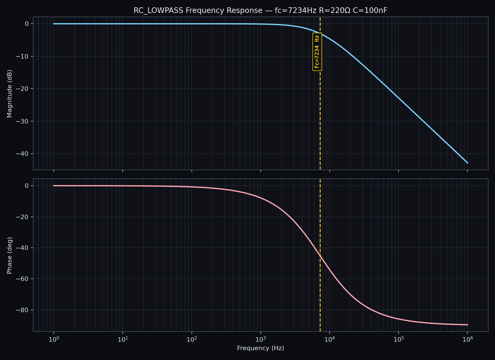
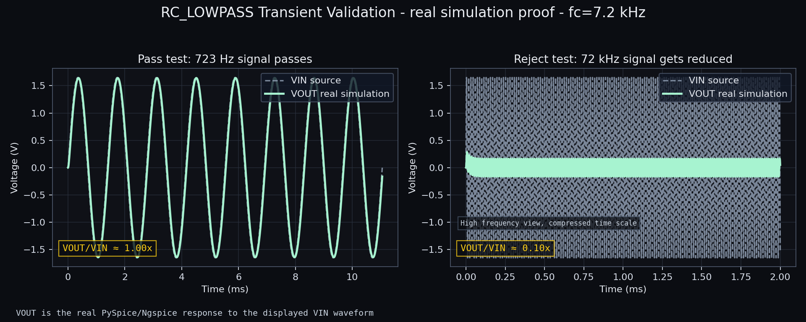
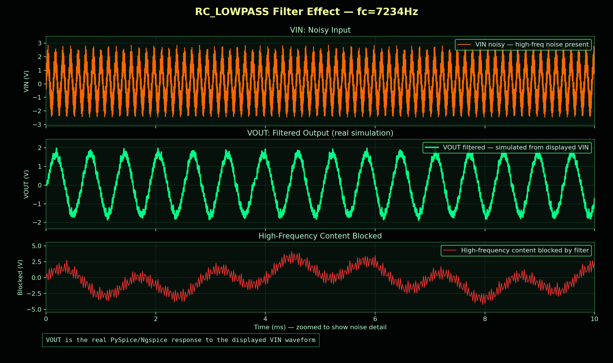
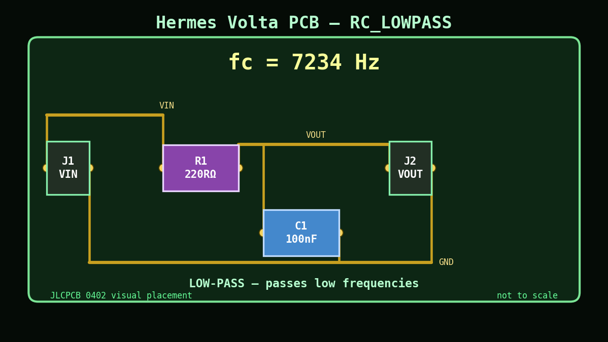

# Demo Artifacts

This folder contains a small curated artifact gallery from the dashboard demo flow. The full generated `outputs/` tree is intentionally ignored because it contains many run-specific files.

Source run:

```text
outputs/RC_LOWPASS_7000Hz_20260502_205538/
```

Prompt:

```text
design a 7kHz low-pass filter at 3.3V
```

## Gallery

### Bode Plot



### Transient Validation



### Filter Effect



### PCB Visual



## Notes

- These are representative demo artifacts.
- Fresh runs write new artifacts under `outputs/`.
- Generated KiCad artifacts are starter outputs for inspection, not production-approved PCB layouts.
